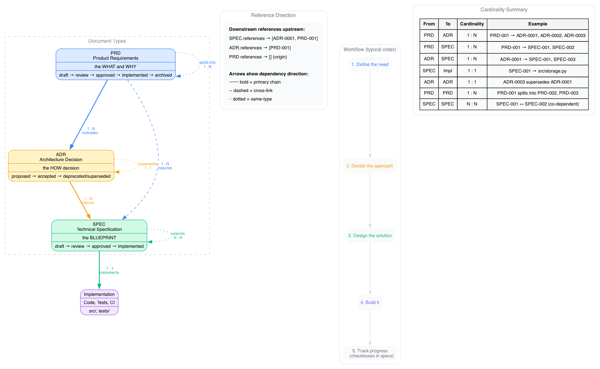

# decree

Software decision lifecycle toolkit. Track the chain from business need (PRD) through architecture decision (ADR) to technical design (SPEC) — with cross-type references, status enforcement, and validation.

## Document Model



| Type | Purpose | Lifecycle | Example |
|------|---------|-----------|---------|
| **PRD** | What to build and why | draft → review → approved → implemented → archived | PRD-001 "User Auth" |
| **ADR** | Architecture decisions | proposed → accepted / rejected / deprecated / superseded | ADR-0001 "Use SQLite" |
| **SPEC** | Technical blueprint | draft → review → approved → implemented | SPEC-001 "Storage API" |

## Install

```bash
uv tool install decree
```

## Quick Start

```bash
# Create documents
decree new prd "User Authentication"
decree new adr "Auth via JWT"
decree new spec "Token Storage"

# Add cross-references (in YAML frontmatter)
# ADR-0001: references: [PRD-001]
# SPEC-001: references: [PRD-001, ADR-0001]

# Validate everything
decree lint

# Track progress (counts checkboxes in docs)
decree progress
```

Output:

```
$ decree progress
  ADR-0001  Auth via JWT    accepted   ███████░░░  67% (2/3)
  PRD-001   User Auth       approved   █████░░░░░  50% (3/6)
  SPEC-001  Token Storage   draft      ███░░░░░░░  29% (2/7)

  ✓ 7/16 items complete (44%) across 3 documents
```

## Commands

| Command | What it does |
|---------|-------------|
| `decree new <type> "title"` | Create a new document |
| `decree status <ID> <action>` | Transition document status |
| `decree lint` | Validate all types + cross-type references |
| `decree index` | Regenerate per-type index files |
| `decree graph` | Generate Mermaid diagrams |
| `decree progress` | Show checkbox completion across all docs |

## Configuration

Add to `pyproject.toml`:

```toml
[tool.doc.types.prd]
dir = "decree/prd"
prefix = "PRD"
digits = 3
initial_status = "draft"
statuses = ["draft", "review", "approved", "implemented", "archived"]
warn_on_reference = ["archived"]
required_sections = ["Problem Statement", "Requirements", "Success Criteria"]

[tool.doc.types.prd.transitions]
draft = ["review"]
review = ["approved", "draft"]
approved = ["implemented", "archived"]
implemented = ["archived"]
archived = []

[tool.doc.types.prd.actions]
approve = "approved"
implement = "implemented"
```

See [docs/configuration.md](docs/configuration.md) for full schema with ADR and SPEC examples.

## What decree validates

- **Dangling references** — SPEC-001 references ADR-0099 which doesn't exist
- **Stale references** — ADR-0001 references PRD-001 which is archived
- **Self-references** — document references itself (copy-paste mistake)
- **Duplicate IDs** — two files map to the same ADR-0001
- **Supersede symmetry** — ADR-0001 says superseded-by ADR-0002, but ADR-0002 doesn't say supersedes ADR-0001
- **Missing sections** — SPEC-001 is missing required "Testing Strategy" section

## Key design

- **`warn_on_reference` != `terminal_statuses`** — "implemented" is terminal (no further transitions) but healthy to reference. "rejected" is terminal AND dead.
- **Staleness is direct-only** — if SPEC-001 → ADR-0001 (superseded), only SPEC-001 is flagged. SPEC-002 → SPEC-001 is fine (SPEC-001 is approved, not dead).
- **No LLM calls** — decree is deterministic and offline. LLM tooling sits on top, consuming decree's output.

## License

MIT
