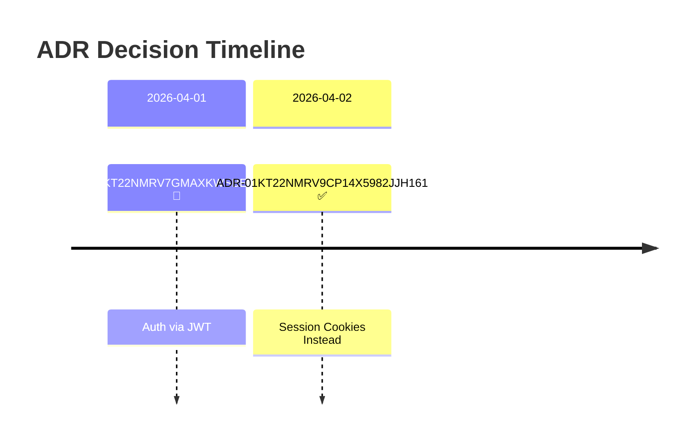
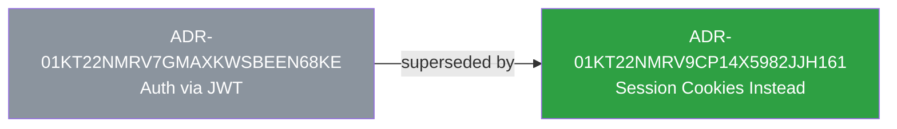
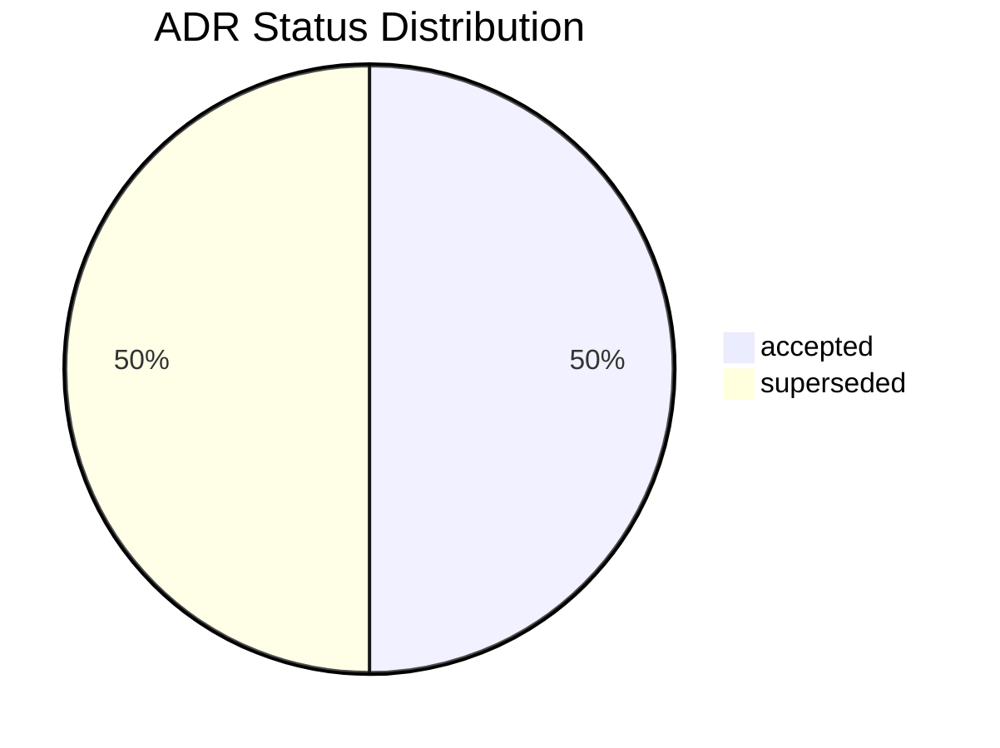

# decree

Software decision lifecycle toolkit. Track the chain from **PRD** (what/why) through **ADR** (how) to **SPEC** (blueprint) — with cross-type references, status enforcement, and validation.

```
PRD (what/why) → ADR (how) → SPEC (blueprint) → Implementation
```

Start with the [Capability Index](docs/index.md) when integrating decree into
another application or an LLM-agent workflow. It explains what decree can do,
which commands own each responsibility, and the expected adoption sequence.

LLM agents contributing to this repository should start with
[AGENTS.md](AGENTS.md), then follow the narrower AGENTS files in the directory
they are changing.

## Install

```bash
pip install decree
# or
uv tool install decree
decree --version
```

## Quick Start

```bash
# Create decree.toml in your project root.
# See docs/configuration.md for the full schema.

# Create documents
decree new prd "User Authentication"
decree new adr "Auth via JWT"
decree new spec "Token Storage API"
```

```
$ decree new adr "Session Cookies Instead"
[new] type: adr, id: ADR-01KT22NMRV8ZFMDKV0WNFNGMCJ
[new] slug: session-cookies-instead
✓ created ADR-01KT22NMRV8ZFMDKV0WNFNGMCJ
```

Add cross-references in YAML frontmatter:

```yaml
# In an ADR:
references: [PRD-01KT22NMRTFTWFFARAN0PVEETA]

# In a SPEC:
references: [PRD-01KT22NMRTFTWFFARAN0PVEETA, ADR-01KT22NMRV8ZFMDKV0WNFNGMCJ]
```

Document IDs are explicit frontmatter values in `TYPE-ULID` form:

```yaml
id: SPEC-01KT22NMS0D19VMD8VPK4D2MNX
status: draft
date: 2026-06-01
```

New files are named `{id-lower}-{slug}.md`, so parallel branches and git
worktrees can create documents without coordinating on the next sequence
number. Legacy numeric corpora can be converted explicitly:

```bash
decree migrate ids --dry-run
decree migrate ids --apply
```

## LLM Agents

decree is designed to be called by LLM agents before and after code changes.
For the agent contract, explicit failure policy, and
recommended command loop, see [LLM Agent Integration](docs/llm-agent-integration.md).
For agent-side `governs:` suggestion generation, use the portable
[decree-governs-suggest skill](skills/decree-governs-suggest/SKILL.md).

decree's provenance is git-grounded but **convention-bounded**: git guarantees
which files a commit changed, while the commit→decision link is the
`Implements:/Refs:/Fixes:` trailer *convention*, not a git guarantee. The
git-derived signals are therefore deterministic to compute, advisory, and
coverage-honest — never certainties. See the
[provenance & determinism model](docs/provenance-model.md).

decree surfaces **governance drift** — decisions whose declared scope has
diverged from where the code actually changed — through `decree health` and the
MCP `health` tool: stale decisions, ungoverned hotspots, dead governance, and
advisory suggested governance. See [Health Signals](docs/health-signals.md).

## Features

### Lint — validate everything

Catches broken references, stale links, missing sections, and more.

```
$ decree lint
✗ 4 documents checked. 1 error.

CROSS-TYPE: SPEC-01KT22NMRW79Y92MKZT807B2J1 references PRD-01HF7YAV2B00000000000000Z7 which does not exist
```

**What it checks:**

| Rule | Example |
|------|---------|
| Dangling references | A SPEC references an ADR ID which does not exist |
| Stale references | An ADR references an archived PRD |
| Self-references | A SPEC references its own ID |
| Duplicate IDs | Two files claim the same frontmatter `id` |
| Supersede symmetry | An ADR says `superseded-by`, but the replacement lacks matching `supersedes` |
| Missing sections | A SPEC is missing required "Testing Strategy" section |
| C4 hierarchy (opt-in) | Parent/depends-on don't resolve, duplicate C4 ids |
| Missing attachments (opt-in) | `--check-attachments` validates file paths exist on disk |

```
$ decree lint
✓ 3 documents validated. 0 errors.

$ decree lint --check-attachments
✓ 3 documents validated. 0 errors.
```

### Status — enforce lifecycle transitions

Only valid transitions are allowed. No skipping steps.

```
$ decree status PRD-01KT22NMRTFTWFFARAN0PVEETA approve
✓ PRD-01KT22NMRTFTWFFARAN0PVEETA draft → approved

$ decree status PRD-01KT22NMRTFTWFFARAN0PVEETA approve
✗ PRD-01KT22NMRTFTWFFARAN0PVEETA cannot transition from 'approved' to 'approved'.
  Valid transitions: implemented, archived.
```

Supersede links both documents automatically:

```
$ decree status ADR-01KT22NMRV7GMAXKWSBEEN68KE supersede ADR-01KT22NMRV9CP14X5982JJH161
[status] transition: accepted → superseded (superseded-by ADR-01KT22NMRV9CP14X5982JJH161)
[status] linking ADR-01KT22NMRV9CP14X5982JJH161 → supersedes ADR-01KT22NMRV7GMAXKWSBEEN68KE
✓ ADR-01KT22NMRV7GMAXKWSBEEN68KE superseded
```

### Progress — checkbox completion tracking

Scans all documents for `- [x]` / `- [ ]` checkboxes.

```
$ decree progress
Scope: all documents

✓ 9/18 items complete (50%) across 3 documents
  ADR-01KT22NMRV8ZFMDKV0WNFNGMCJ   Auth via JWT         accepted  ███████░░░  67% (2/3)
  PRD-01KT22NMRTFTWFFARAN0PVEETA   User Authentication  approved  ██████░░░░  57% (4/7)
  SPEC-01KT22NMS0D19VMD8VPK4D2MNX  Token Storage API    draft     ████░░░░░░  38% (3/8)
```

For parallel work, scope progress explicitly:

```bash
decree progress --doc SPEC-01KT22NMS0D19VMD8VPK4D2MNX
decree progress --chain PRD-01KT22NMRTFTWFFARAN0PVEETA
decree progress --changed --base origin/main
decree progress --governs src/decree/parser.py
```

### Report — refresh completion snapshots

Completion reports are generated when a document transitions to a
terminal-success status. They are snapshots; if acceptance criteria are edited
after the transition, regenerate the report explicitly.

```
$ decree report regenerate SPEC-01KT22NMS0KTWGNKB36RR7K0JR
[report] wrote SPEC-01KT22NMS0KTWGNKB36RR7K0JR -> decree/spec/reports/SPEC-01KT22NMS0KTWGNKB36RR7K0JR.md
✓ report regenerate: written=1, skipped=0
```

Use `--all --existing-only` to refresh committed report files without creating
new report files for older terminal documents that never had one.

### Index — derived query cache and generated tables

`decree index rebuild` rebuilds `.decree/index.sqlite`, the derived query
cache used by `why`, `refs`, MCP tools, health, intent-review/check, and
retrieval evaluation.

`decree index regenerate` regenerates the markdown `index.md` table per
document type, sorted by status priority.

```
$ decree index regenerate
✓ index regenerated for 3 type(s)
```

Produces tables like:

```markdown
| ADR | Title | Status | Date | Supersedes |
|-----|-------|--------|------|------------|
| ADR-01KT22NMRV9CP14X5982JJH161 | Session Cookies Instead | proposed | 2026-04-30 | ADR-01KT22NMRV7GMAXKWSBEEN68KE |
| ADR-01KT22NMRV7GMAXKWSBEEN68KE | Auth via JWT | superseded | 2026-04-30 |  |
```

### Graph — Mermaid diagrams

Generates decision timelines, supersede chains, status distribution pie charts, and C4 container views. Appended to each type's `index.md` below a generated marker.

```
$ decree graph
[graph] generated timeline for adr
[graph] generated supersede graph for adr
[graph] generated status distribution for adr
✓ generated diagrams for 3 type(s)
```

Example output in `index.md`:

````markdown
<!-- GENERATED:decree-graph — do not edit below this line -->

## Decision Timeline



## Decision Chain



## Status Distribution


````

### Attachments — link external artifacts

Reference design files, wireframes, or architecture diagrams in frontmatter:

```yaml
attachments:
  - .stitch/designs/overview.png
  - docs/wireframes/detail-view.png
```

Paths are relative to project root. Validated only with `--check-attachments` (won't break CI where files aren't committed).

### C4 Architecture (opt-in)

Add `[types.spec.c4]` to `decree.toml` to enable C4 validation and diagram generation on SPECs:

```yaml
# In spec frontmatter:
id: SPEC-01KT22NMRWENYKC3MGRA50M7GE
c4_id: demand_model
c4_type: container
c4_name: Demand Model
c4_tech: Python / scipy
parent: system_boundary_id
depends-on: ["data_preparation"]
```

`decree lint` validates C4 hierarchy. `decree graph` generates C4Container Mermaid diagrams.

## Configuration

All config lives in `decree.toml`. Define any document type you need:

```toml
[types.prd]
dir = "decree/prd"
prefix = "PRD"
initial_status = "draft"
statuses = ["draft", "review", "approved", "implemented", "archived"]
warn_on_reference = ["archived"]
required_sections = ["Problem Statement", "Requirements", "Success Criteria"]

[types.prd.transitions]
draft = ["review"]
review = ["approved", "draft"]
approved = ["implemented", "archived"]
implemented = ["archived"]
archived = []

[types.prd.actions]
approve = "approved"
implement = "implemented"
archive = "archived"
```

Not limited to PRD/ADR/SPEC — define any document type with its own prefix, statuses, transitions, and validation rules.

See [docs/configuration.md](docs/configuration.md) for full schema reference.

## Claude Code Integration

Decree ships as a [Claude Code](https://claude.com/product/claude-code) plugin with skills for AI-assisted document creation:

| Skill | What it does |
|-------|-------------|
| `/decree:init` | Scaffold `decree/` folder with working examples |
| `/decree:prd` | Create a PRD with section guidance and lint validation |
| `/decree:adr` | Create an ADR with reference discovery across existing docs |
| `/decree:spec` | Create a SPEC with stale-reference warnings |
| `/decree:lint` | Validate all documents, create tasks per error found |
| `/decree:ddd` | Check project state, guide next step in the PRD→ADR→SPEC flow |
| `decree-governs-suggest` | Agent-side `governs:` suggestions from the analyze JSON contract |

## Live Example: Decree Managing Itself

Decree dogfoods its own workflow. This repo uses decree to track its own features:

```
$ decree progress
Scope: all documents

  SPEC-01KT22NMRWENYKC3MGRA50M7GE  C4 Validation and Diagram Generation      implemented  ██████████ 100% (32/32 primary); deferred 0/5
  SPEC-01KT22NMS0BN1F5B01HEFK87W0  Provider-Free Agent Suggestion Contract   implemented  ██████████ 100% (17/17 primary)
  SPEC-01KT22NMS0D19VMD8VPK4D2MNX  Parallel-Safe Document Identity...        implemented  ██████████ 100% (11/11 primary)

✓ 368/368 primary items complete (100%) across 25 documents
[progress] 0/69 deferred items separated from primary progress
```

Several features are tracked at different lifecycle stages:

**C4 Architecture Support** (implemented)
```
PRD-01KT22NMRR63TXR7NX5XYRG5FK → ADR-01KT22NMRV7GMAXKWSBEEN68KE → SPEC-01KT22NMRWENYKC3MGRA50M7GE
```
The decision chain is complete. The PRD defined what C4 support means, the ADR chose a coupled module over a plugin architecture, and the SPEC has 32/32 primary acceptance criteria checked off. Deferred items are explicitly separated from completion math.

**DDD CLI & Proofshot** (implemented)
```
PRD-01KT22NMRR0BX7KBF0F0N5ER6Z → implemented SPECs and reports
```
The PRD and implementation SPEC are terminal-success, with generated completion reports available under `decree/*/reports/`.

Current DDD assessment:

```bash
$ decree ddd
Phase: PLANNING
Progress: 95% primary (367/388)
Deferred: 0/90 items separated from primary progress
Next action: write an implementation plan for SPEC-01KT22NMS0BN1F5B01HEFK87W0
```

This is what Decree Driven Development looks like — every feature has a traceable chain from business need to implementation, with checkboxes tracking progress at every level.

## Roadmap

See [docs/roadmap.md](docs/roadmap.md) for planned features and ideas — including lightweight decision logs, release notes skill, and custom templates.

## Release and Versioning

Package versioning is single-sourced from `[project].version` in
`pyproject.toml`. Runtime surfaces such as `decree --version` and
`decree.__version__` read installed package metadata instead of duplicating the
version string in source files.

Changelog entries are Towncrier fragments in `changelog.d/`. Agents should add
one fragment with each user-visible change; release builds generate
`CHANGELOG.md` from those fragments.

Pushing a `vX.Y.Z` tag runs the release workflow: validate, build, publish to
PyPI through Trusted Publishing, and create a GitHub Release. See
[docs/release.md](docs/release.md).

## Contributing

See [CONTRIBUTING.md](CONTRIBUTING.md) for setup, developer guidelines, and code style.

## Design Principles

- **Explicit LLM boundaries** — core lifecycle, lint, index, query, progress,
  `migrate governs`, and `intent-check` are deterministic. Agents may call
  LLMs outside decree, then hand explicit JSON back to decree for validation
  and application.
- **Config-driven** — no hardcoded document types. Everything is defined in `decree.toml`.
- **`warn_on_reference` != terminal** — "implemented" is terminal (no further transitions) but healthy to reference. "rejected" is terminal AND dead.
- **Staleness is direct-only** — if a SPEC directly references a superseded ADR, only that SPEC is flagged. Transitive chains are not followed.

## License

MIT
