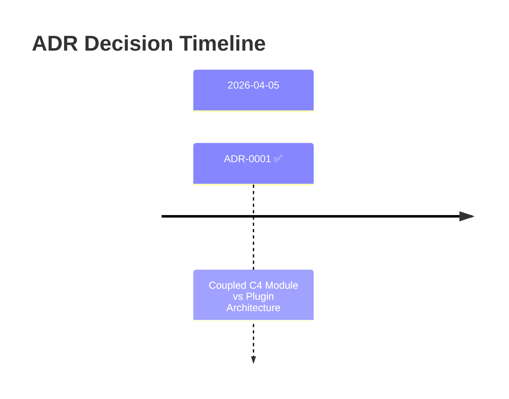
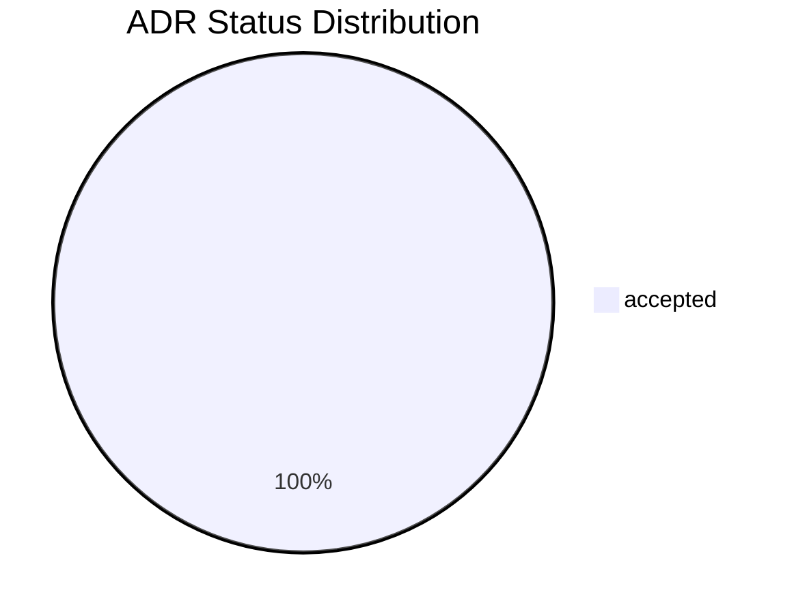

# ADRs

> ADR documents — auto-generated by `decree index`.

| ADR | Title | Status | Date | Supersedes |
|-----|-------|--------|------|------------|
| ADR-0001 | ADR-0001 Coupled C4 Module vs Plugin Architecture | accepted | 2026-04-05 |  |

<!-- GENERATED:decree-graph — do not edit below this line -->

## Decision Timeline

## Status Distribution

