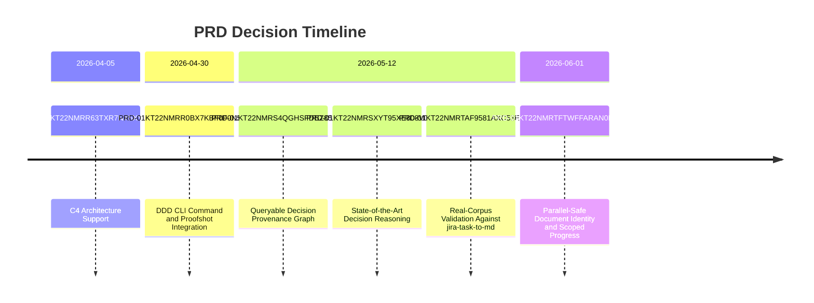
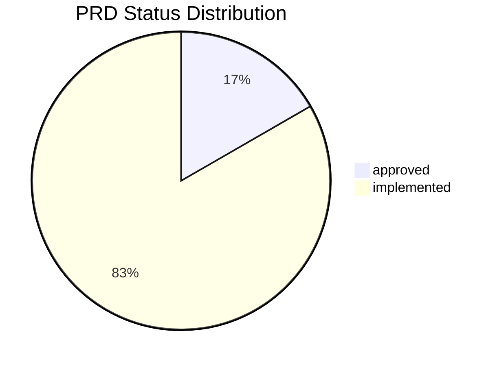

# PRDs

> PRD documents — auto-generated by `decree index regenerate`.

| PRD | Title | Status | Date |
|-----|-----|-----|-----|
| PRD-01KT22NMRTAF9581AXC53EHQTW | Real-Corpus Validation Against jira-task-to-md | approved | 2026-05-12 |
| PRD-01KT22NMRR63TXR7NX5XYRG5FK | C4 Architecture Support | implemented | 2026-04-05 |
| PRD-01KT22NMRR0BX7KBF0F0N5ER6Z | DDD CLI Command and Proofshot Integration | implemented | 2026-04-30 |
| PRD-01KT22NMRS4QGHSFDBZ858PP1T | Queryable Decision Provenance Graph | implemented | 2026-05-12 |
| PRD-01KT22NMRSXYT95XE808VD8EV4 | State-of-the-Art Decision Reasoning | implemented | 2026-05-12 |
| PRD-01KT22NMRTFTWFFARAN0PVEETA | Parallel-Safe Document Identity and Scoped Progress | implemented | 2026-06-01 |

<!-- GENERATED:decree-graph — do not edit below this line -->

## Decision Timeline

## Status Distribution

